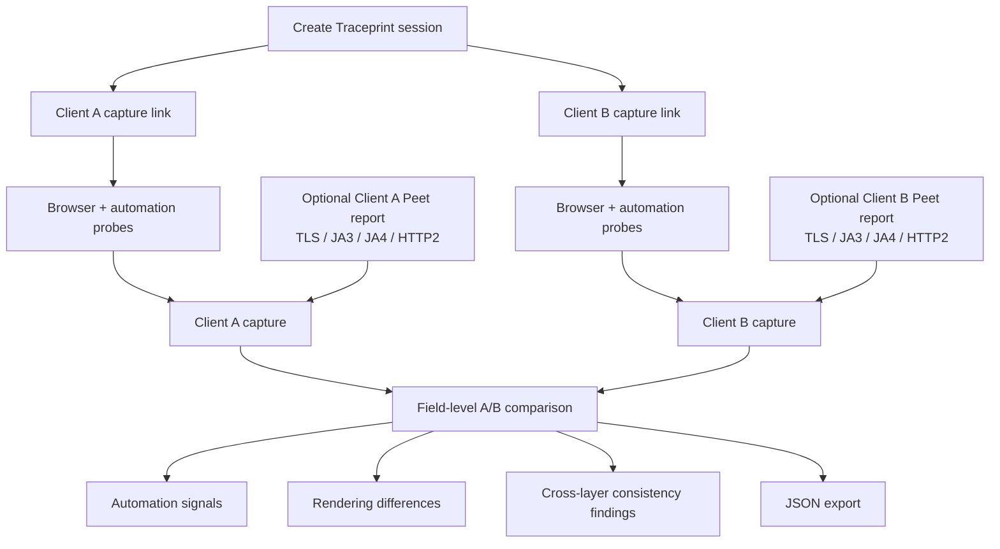

# Traceprint

Traceprint is a **cross-layer A/B fingerprint comparison laboratory** for understanding why two browser or automation clients are observed differently.

It creates two capability-protected capture links, records browser-visible and automation-related evidence, accepts imported TLS/JA3/JA4/HTTP/2 reports, and then explains the differences across browser, CDP, rendering, transport, and consistency layers.

The goal is simple: instead of manually comparing several fingerprinting tools and trying to remember what changed between two clients, Traceprint gives both clients the same experiment and produces a structured side-by-side comparison.

## Why this exists

When debugging crawling or anti-bot failures, the difficult question is often not *whether* two clients differ, but **where the difference comes from**.

A browser may look normal at the JavaScript layer while still exposing automation behavior through CDP interaction. Two clients may have matching navigator values but different Canvas/WebGL output. A browser profile may look internally consistent while its TLS or HTTP/2 behavior comes from a completely different software stack.

Traceprint was built to make those differences easier to isolate experimentally.

Typical questions it helps investigate include:

- What changed between a normal browser and an automated browser?
- Does opening DevTools change any observable runtime behavior?
- Are browser-window and worker identities internally consistent?
- Do rendering fingerprints such as Canvas, WebGL, audio, or fonts differ?
- Does the browser-visible identity agree with imported TLS, JA3, JA4, and HTTP/2 evidence?
- Which differences are strong automation signals, and which are only ambiguous observations?

## How Traceprint works

A Traceprint session creates two independent capture targets — **Client A** and **Client B**.



Each client visits its own capture URL. Traceprint records browser-visible evidence, automation observations, rendering fingerprints, worker identity, and other environment details. Transport evidence can then be imported from `tls.peet.ws` and compared with the browser-side capture.

The result is not just a flat fingerprint dump: Traceprint computes field-level differences and consistency findings so that the interesting mismatches are easier to identify.

## What Traceprint compares

### Browser and environment

- Navigator and descriptor-integrity observations
- Screen and display properties
- Locale and timezone-related values
- Hardware and feature exposure
- Main-window identity
- Dedicated-worker identity
- Cross-context consistency

### Rendering fingerprints

- Canvas
- WebGL
- Audio
- Fonts
- Screen-related rendering properties

### Automation and browser-control evidence

- `navigator.webdriver`
- ChromeDriver-style globals
- Playwright and other known automation markers
- Early synchronous runtime probes that execute before React
- Runtime/Console serialization observations
- Prototype-chain serialization fallback observations
- DevTools timing observations kept separate from stronger WebDriver evidence

### Transport evidence

Traceprint can import reports from `tls.peet.ws` and compare:

- TLS characteristics
- JA3
- JA4
- HTTP/2 behavior

The hosted edition imports transport reports rather than capturing the original ClientHello directly because Cloudflare terminates the incoming TLS connection before Pages Functions can inspect it.

## CDP and automation observations

Traceprint deliberately treats CDP-related observations as **evidence, not proof**.

One runtime technique observes whether an `Error` object's properties are accessed while the value is being serialized through Console/Runtime behavior. A second prototype-chain observation acts as a fallback for cases where the original property path is altered or patched.

These observations are useful because browser-control tooling can cause JavaScript values to be inspected or serialized differently from an untouched page context. However, the signal is not unique to automation:

- opening DevTools can also cause serialization behavior;
- an automation client may avoid the observation if it does not enable the relevant CDP domains;
- `Error.name` getter activity is retained as diagnostic evidence but is **not** considered CDP detection by itself.

For that reason, Traceprint reports Runtime/Console detection as a separate boolean observation and keeps it distinct from the overall score.

## Scoring

Traceprint's overall score starts at **100** and deducts implemented penalties for automation-risk signals and cross-layer inconsistencies.

It is intended as a compact summary for comparison, not as a universal bot-detection score and not as a CDP score. The underlying evidence is more important than the number itself.

## Session design

- Anonymous sessions expire after 24 hours.
- Client A and Client B receive independent capture links.
- Owner and capture capabilities are stored in URL fragments so they are not sent as part of normal navigation requests.
- Captures can be compared field-by-field and exported as JSON.

## Stack

- React
- Vite
- TypeScript
- Cloudflare Pages
- Cloudflare Pages Functions
- Cloudflare D1
- Vitest

The UI uses custom CSS inspired by the compact dark-laboratory styling of ShieldFont Decoder.

## Current scope and limitations

Traceprint is an **experimental comparison tool**, not a claim of universal browser or bot detection.

Some signals are environment-dependent, browser-version-dependent, or intentionally ambiguous. A clean result does not prove that a client is indistinguishable from a normal browser, and a detected observation does not necessarily imply automation.

Transport comparison in the hosted version currently depends on imported Peet reports because the Cloudflare deployment cannot inspect the original raw TLS handshake.

The project is most useful when the same controlled experiment is run against two clients and the resulting differences are interpreted together rather than treating any single signal as definitive.

## Local development

Install dependencies and start the frontend:

```bash
npm install
npm run dev
```

## Full local Pages environment

Run:

```bash
npm run pages:dev
```

Wrangler provides a persistent local D1 binding, and Traceprint initializes its schema when the first session is created.

## Cloudflare Pages deployment

1. Create a D1 database named `traceprint`.
2. Apply `migrations/0001_initial.sql`.
3. Create a Cloudflare Pages project connected to this repository.
4. Use `npm run build` as the build command.
5. Use `dist` as the output directory.
6. Add a D1 binding named `DB` to the Pages project.

## Research acknowledgement

The Runtime/CDP work is informed by the public MIT-licensed **Brotector** project. Traceprint uses its own non-destructive implementation and intentionally preserves ambiguity between DevTools and automation where the evidence does not justify a stronger conclusion.

## License

MIT
